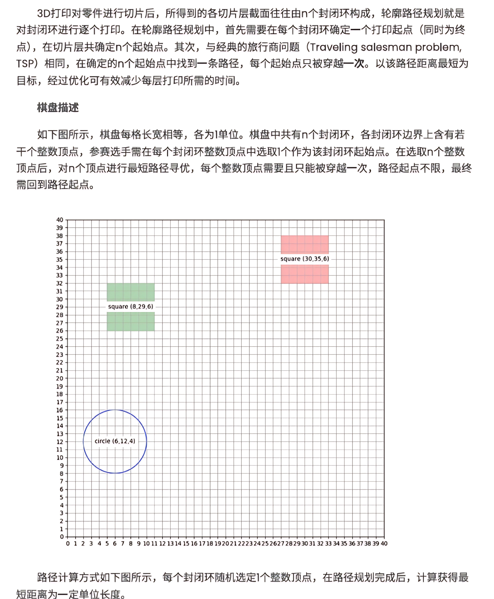
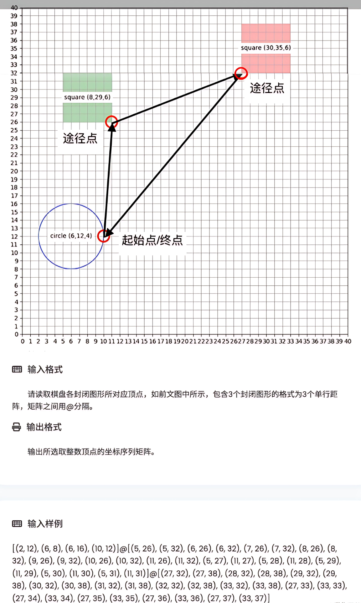

# TSPSolver

TSPSolver 是一个用于解决旅行商问题（Traveling Salesman Problem, TSP）的Python工具。它结合了暴力法和Christofides近似算法，能够高效地为不同规模的数据集找到最优或近似最优的路径。

<div align="center">
  
  
</div>

## 功能特点

- **多种算法支持**：
  - **暴力法**：通过穷举所有可能的路径来找到最短路径，适用于较小规模的数据集（如点数 ≤ 10）。
  - **Christofides算法**：一种高效的近似算法，适用于较大规模的数据集。它通过最小生成树和完美匹配来构造近似最优路径。

- **灵活的输入解析**：支持从字符串输入中解析多个点集，每个点集可以独立求解。

- **模块化设计**：代码结构清晰，每个功能模块独立实现，方便扩展和维护。

- **性能优化**：在Christofides算法中，根据奇数度节点的数量选择不同的匹配算法（暴力法或贪心法），以平衡准确性和效率。

## 使用方法

### 安装依赖

```bash
pip install numpy
```

# 算法细节

## 暴力法

暴力法通过穷举所有可能的路径来找到最短路径。它适用于点数较少的情况，因为其时间复杂度为 \(O(n!)\)。

## Christofides算法

Christofides算法是一种高效的近似算法，适用于较大规模的数据集。其主要步骤包括：

1. **计算最小生成树（MST）**：使用Prim算法。
2. **找到奇数度节点**：在MST中，找到所有度为奇数的节点。
3. **计算完美匹配**：对于奇数度节点，使用暴力法或贪心法计算完美匹配。
4. **构造欧拉路径**：将MST和完美匹配的边合并，构造欧拉路径。
5. **提取哈密尔顿路径**：从欧拉路径中提取不重复访问任何节点的路径。

## 性能表现

在测试数据集上，TSPSolver表现出色，能够快速找到接近最优的解。以下是部分测试结果：

- 8.17分
- 8.92分
- 31.74分
- 16.72分
- 36.27分
- 57.41分
- 49.13分
- 139.80分
- 127.00分
- 261.33分

## 贡献指南

欢迎任何有助于改进TSPSolver的贡献！无论是修复bug、优化算法还是添加新功能，我们都欢迎你的参与。请遵循以下步骤：

1. **Fork** 本项目。
2. 在本地开发环境中进行修改。
3. 提交**Pull Request**，并简要描述你的修改内容。

## 许可证

TSPSolver 采用 MIT License 开源许可。

---
